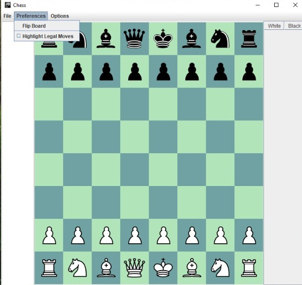
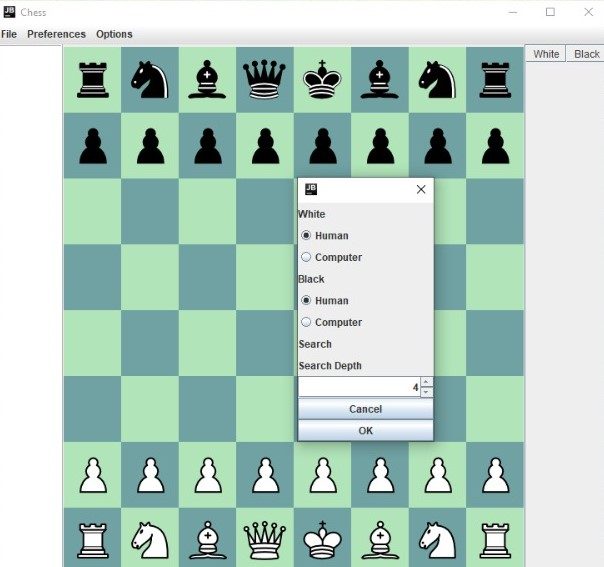
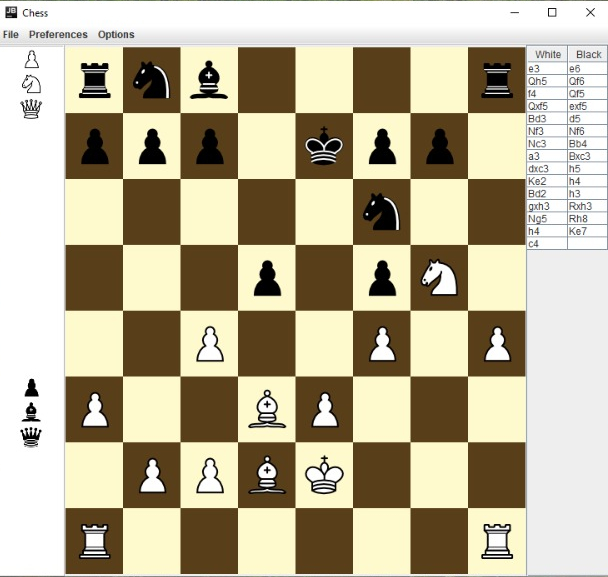

# chess-bot-gui

Chess Graphical User Interface and Engine developed from scratch in Java.

## Features

* Legal moves highlight
* Board flip
* Game Setup
* Move log
* Taken pieces shown

 

## Playing modes

* Human vs Human
* Human vs Engine
* Engine vs Engine

## Engine
Simple minmax with max depth = 4. Even so, the AI plays decently:

